# Evaluation Process

## Overview

The evaluation pipeline scores segmentation submissions against ground truth data.
Labels are classified as either **instance** (e.g. mito, nuc, ves) or **semantic**
segmentation and scored with different metrics accordingly. Results are aggregated
across all crops and labels into a single overall score.

## Flowchart

```mermaid
flowchart TD
    Start([score_submission]) --> Config["Load EvaluationConfig<br/>from env / defaults"]
    Config --> Unzip["Unzip submission .zip<br/>to .zarr directory"]
    Unzip --> Validate["Validate Zarr-2 structure<br/>ensure .zgroup exists<br/>handle nested folders"]
    Validate --> Discover["Discover volumes<br/>compare submission vs ground truth dirs"]

    Discover --> PrefixCheck{Volumes found?}
    PrefixCheck -- No --> AddPrefix["Try adding 'crop' prefix<br/>to predicted volume names"]
    AddPrefix --> PrefixCheck2{Volumes found now?}
    PrefixCheck2 -- No --> Error([Raise ValueError])
    PrefixCheck2 -- Yes --> SplitVolumes
    PrefixCheck -- Yes --> SplitVolumes

    SplitVolumes["Split into found_volumes<br/>and missing_volumes"]

    SplitVolumes --> ScoreMissing["Score missing volumes as zeros<br/>empty_label_score for each label"]
    SplitVolumes --> BuildArgs["Build evaluation args<br/>for found volumes"]

    BuildArgs --> PerVolume["For each found volume:<br/>list predicted & truth labels<br/>identify found & missing labels"]
    PerVolume --> ArgTuples["Create (pred_path, label,<br/>crop, truth_path, instance_classes)<br/>for each truth label"]

    ScoreMissing --> Aggregate
    ArgTuples --> Parallel

    subgraph Parallel[Parallel Scoring]
        direction TB
        Route{Label type?}
        Route -- Instance class --> InstPool["ProcessPoolExecutor<br/>max_instance_threads workers"]
        Route -- Semantic class --> SemPool["ProcessPoolExecutor<br/>max_semantic_threads workers"]
        InstPool --> ScoreLabel
        SemPool --> ScoreLabel
    end

    subgraph ScoreLabel[score_label]
        direction TB
        CheckMissing{"Label in<br/>submission?"}
        CheckMissing -- No --> EmptyScore["Return empty_label_score<br/>status: missing"]
        CheckMissing -- Yes --> LoadData

        subgraph LoadData[Load & Align Data]
            direction TB
            LoadTruth["Load ground truth<br/>from zarr"] --> CheckMask
            LoadPred["Load prediction &<br/>match_crop_space:<br/>rescale, resample, align"] --> CheckMask
            CheckMask{Mask exists?}
            CheckMask -- Yes --> ApplyMask["Apply mask to both<br/>pred and truth arrays"]
            CheckMask -- No --> BranchType
            ApplyMask --> BranchType
        end

        BranchType{"Instance or<br/>Semantic?"}
        BranchType -- Instance --> InstanceScoring
        BranchType -- Semantic --> SemanticScoring
    end

    subgraph InstanceScoring[score_instance]
        direction TB
        CC["Relabel prediction via<br/>cc3d.connected_components"]
        CC --> BinaryMetrics["Compute binary metrics<br/>(IoU, Dice, binary accuracy)"]
        CC --> VoI["Compute rand_voi<br/>split & merge errors"]
        BinaryMetrics --> Matching
        VoI --> Matching

        subgraph Matching[match_instances]
            direction TB
            CountInstances["Count instances<br/>nG = max GT, nP = max pred"]
            CountInstances --> SpecialCase{nG=0 or nP=0?}
            SpecialCase -- Yes --> EmptyMatch[Return empty mapping]
            SpecialCase -- No --> RatioCheck

            RatioCheck["Check pred/GT ratio<br/>vs dynamic cutoff"]
            RatioCheck --> RatioOK{Ratio OK?}
            RatioOK -- No --> TooMany([TooManyInstancesError])
            RatioOK -- Yes --> ComputeOverlaps

            ComputeOverlaps["Compute IoU overlaps<br/>between all instance pairs"]
            ComputeOverlaps --> EdgeCheck{"Edges within<br/>limit?"}
            EdgeCheck -- No --> TooManyEdges([TooManyOverlapEdgesError])
            EdgeCheck -- Yes --> MCF

            MCF["Solve min-cost flow<br/>OR-Tools SimpleMinCostFlow<br/>1:1 optimal matching"]
            MCF --> MCFStatus{Solve status?}
            MCFStatus -- Optimal --> ExtractMap["Extract pred_id to gt_id<br/>mapping from flow arcs"]
            MCFStatus -- Failed --> MatchFail([MatchingFailedError])
        end

        Matching --> MatchResult{"Matching<br/>succeeded?"}
        MatchResult -- No --> Pathological["Return pathological scores<br/>accuracy=0, combined=0<br/>keep binary & VoI metrics"]
        MatchResult -- Yes --> Remap["Remap prediction IDs<br/>to match ground truth IDs"]
        Remap --> Hausdorff

        subgraph Hausdorff[Hausdorff Distance Computation]
            direction TB
            GetIDs[Get unique GT instance IDs]
            GetIDs --> PerInstance["For each instance (threaded):<br/>Extract ROI bounding box<br/>Compute distance transforms<br/>Calculate Hausdorff distance"]
            PerInstance --> Unmatched["Add max_distance for<br/>unmatched predictions"]
        end

        Hausdorff --> FinalInstance["Compute final instance scores:<br/>accuracy = mean(truth == pred)<br/>hausdorff = mean(distances)<br/>norm_hausdorff = mean(normalized)<br/>combined = sqrt(accuracy * norm_hausdorff)"]
    end

    subgraph SemanticScoring[score_semantic]
        direction TB
        Binarize["Binarize both arrays<br/>(threshold > 0)"]
        Binarize --> EmptyCheck{Both empty?}
        EmptyCheck -- Yes --> Perfect[All scores = 1.0]
        EmptyCheck -- No --> SemMetrics["Compute metrics:<br/>IoU = jaccard_score<br/>Dice = 1 - dice distance<br/>binary_accuracy = mean match"]
    end

    InstanceScoring --> AddMeta
    SemanticScoring --> AddMeta
    EmptyScore --> AddMeta
    AddMeta["Add metadata:<br/>num_voxels, voxel_size,<br/>is_missing flag"]

    Parallel --> Aggregate

    subgraph Aggregate[Aggregate & Save Results]
        direction TB
        Collect["Collect all<br/>crop/label results"]
        Collect --> CombineLabels["Combine per-label scores<br/>across crops, weighted<br/>by voxel count"]
        CombineLabels --> OverallInstance["Overall Instance Score =<br/>voxel-weighted mean of<br/>combined_score across<br/>instance labels"]
        CombineLabels --> OverallSemantic["Overall Semantic Score =<br/>voxel-weighted mean of<br/>IoU across semantic labels"]
        OverallInstance --> OverallScore["Overall Score =<br/>sqrt(instance * semantic)<br/>(geometric mean)"]
        OverallSemantic --> OverallScore
        OverallScore --> Sanitize["Sanitize scores:<br/>NaN/Inf -> None<br/>numpy types -> Python types"]
        Sanitize --> Save["Save results JSON:<br/>- all_scores (with missing)<br/>- submitted_only scores"]
    end

    Aggregate --> End([Return scores])
```

## Metrics

### Instance Segmentation

| Metric | Description |
|--------|-------------|
| `accuracy` | Voxel-wise match rate after instance ID alignment |
| `hausdorff_distance` | Mean Hausdorff distance across all matched instances |
| `normalized_hausdorff_distance` | Hausdorff normalized to [0, 1] via exponential decay |
| `combined_score` | `sqrt(accuracy * normalized_hausdorff_distance)` |
| `iou` | Binary foreground IoU (Jaccard index) |
| `dice_score` | Binary foreground Dice coefficient |
| `voi_split` | Variation of Information split error |
| `voi_merge` | Variation of Information merge error |

### Semantic Segmentation

| Metric | Description |
|--------|-------------|
| `iou` | Binary Jaccard index |
| `dice_score` | Binary Dice coefficient |
| `binary_accuracy` | Voxel-wise binary match rate |

### Overall

| Metric | Description |
|--------|-------------|
| `overall_instance_score` | Voxel-weighted mean of `combined_score` across instance labels |
| `overall_semantic_score` | Voxel-weighted mean of `iou` across semantic labels |
| `overall_score` | `sqrt(overall_instance_score * overall_semantic_score)` |
