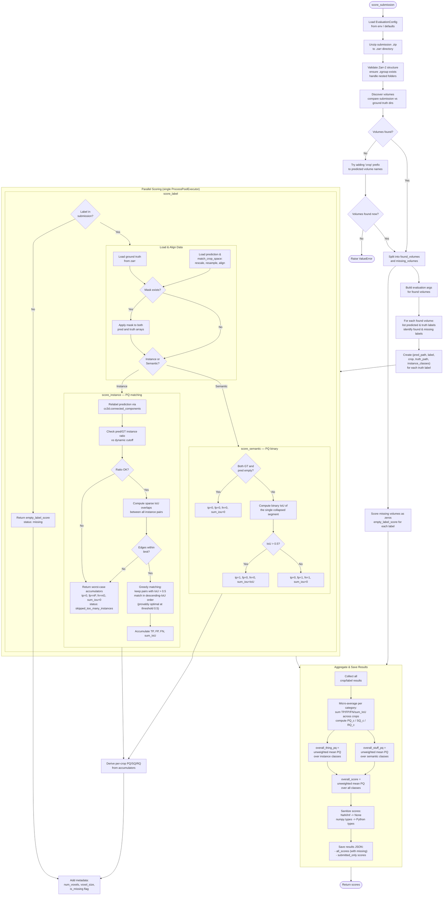

# Evaluation Process

## Overview

The evaluation pipeline scores segmentation submissions against ground truth data.
All labels — both **instance** ("thing") classes (e.g. `mito`, `nuc`, `ves`) and
**semantic** ("stuff") classes — are evaluated using **Panoptic Quality (PQ)**
accumulators (TP / FP / FN / sum\_IoU).  Per-category PQ / SQ / RQ are
micro-averaged across crops; the final overall score is the unweighted mean PQ
across all categories.

## Flowchart

```mermaid
flowchart TD
    Start([score_submission]) --> Config["Load EvaluationConfig<br/>from env / defaults"]
    Config --> Unzip["Unzip submission .zip<br/>to .zarr directory"]
    Unzip --> Validate["Validate Zarr-2 structure<br/>ensure .zgroup exists<br/>handle nested folders"]
    Validate --> Discover["Discover volumes<br/>compare submission vs ground truth dirs"]

    Discover --> PrefixCheck{Volumes found?}
    PrefixCheck -- No --> AddPrefix["Try adding 'crop' prefix<br/>to predicted volume names"]
    AddPrefix --> PrefixCheck2{Volumes found now?}
    PrefixCheck2 -- No --> Error([Raise ValueError])
    PrefixCheck2 -- Yes --> SplitVolumes
    PrefixCheck -- Yes --> SplitVolumes

    SplitVolumes["Split into found_volumes<br/>and missing_volumes"]

    SplitVolumes --> ScoreMissing["Score missing volumes as zeros<br/>empty_label_score for each label"]
    SplitVolumes --> BuildArgs["Build evaluation args<br/>for found volumes"]

    BuildArgs --> PerVolume["For each found volume:<br/>list predicted & truth labels<br/>identify found & missing labels"]
    PerVolume --> ArgTuples["Create (pred_path, label,<br/>crop, truth_path, instance_classes)<br/>for each truth label"]

    ScoreMissing --> Aggregate
    ArgTuples --> Parallel

    subgraph Parallel["Parallel Scoring (single ProcessPoolExecutor)"]
        direction TB
        ScoreLabel
    end

    subgraph ScoreLabel[score_label]
        direction TB
        CheckMissing{"Label in<br/>submission?"}
        CheckMissing -- No --> EmptyScore["Return empty_label_score<br/>status: missing"]
        CheckMissing -- Yes --> LoadData

        subgraph LoadData[Load & Align Data]
            direction TB
            LoadTruth["Load ground truth<br/>from zarr"] --> CheckMask
            LoadPred["Load prediction &<br/>match_crop_space:<br/>rescale, resample, align"] --> CheckMask
            CheckMask{Mask exists?}
            CheckMask -- Yes --> ApplyMask["Apply mask to both<br/>pred and truth arrays"]
            CheckMask -- No --> BranchType
            ApplyMask --> BranchType
        end

        BranchType{"Instance or<br/>Semantic?"}
        BranchType -- Instance --> InstanceScoring
        BranchType -- Semantic --> SemanticScoring
    end

    subgraph InstanceScoring[score_instance — PQ matching]
        direction TB
        CC["Relabel prediction via<br/>cc3d.connected_components"]
        CC --> RatioCheck["Check pred/GT instance ratio<br/>vs dynamic cutoff"]
        RatioCheck --> RatioOK{Ratio OK?}
        RatioOK -- No --> SkipPQ["Return worst-case accumulators<br/>tp=0, fp=nP, fn=nG, sum_iou=0<br/>status: skipped_too_many_instances"]
        RatioOK -- Yes --> ComputeOverlaps

        ComputeOverlaps["Compute sparse IoU overlaps<br/>between all instance pairs"]
        ComputeOverlaps --> EdgeCheck{"Edges within<br/>limit?"}
        EdgeCheck -- No --> SkipPQ
        EdgeCheck -- Yes --> GreedyMatch

        GreedyMatch["Greedy matching:<br/>keep pairs with IoU > 0.5<br/>match in descending-IoU order<br/>(provably optimal at threshold 0.5)"]
        GreedyMatch --> PQAccum["Accumulate TP, FP, FN, sum_IoU"]
    end

    subgraph SemanticScoring[score_semantic — PQ binary]
        direction TB
        BothEmpty{Both GT and<br/>pred empty?}
        BothEmpty -- Yes --> ZeroAccum["tp=0, fp=0, fn=0, sum_iou=0"]
        BothEmpty -- No --> ComputeIoU["Compute binary IoU of<br/>the single collapsed segment"]
        ComputeIoU --> IoUCheck{"IoU > 0.5?"}
        IoUCheck -- Yes --> SemanticTP["tp=1, fp=0, fn=0, sum_iou=IoU"]
        IoUCheck -- No --> SemanticFPFN["tp=0, fp=1, fn=1, sum_iou=0"]
    end

    InstanceScoring --> DerivePQ
    SemanticScoring --> DerivePQ
    EmptyScore --> AddMeta
    DerivePQ["Derive per-crop PQ/SQ/RQ<br/>from accumulators"]
    DerivePQ --> AddMeta
    AddMeta["Add metadata:<br/>num_voxels, voxel_size,<br/>is_missing flag"]

    Parallel --> Aggregate

    subgraph Aggregate[Aggregate & Save Results]
        direction TB
        Collect["Collect all<br/>crop/label results"]
        Collect --> MicroAvg["Micro-average per category:<br/>sum TP/FP/FN/sum_IoU across crops<br/>compute PQ_c / SQ_c / RQ_c"]
        MicroAvg --> OverallThing["overall_thing_pq =<br/>unweighted mean PQ<br/>over instance classes"]
        MicroAvg --> OverallStuff["overall_stuff_pq =<br/>unweighted mean PQ<br/>over semantic classes"]
        OverallThing --> OverallScore["overall_score =<br/>unweighted mean PQ<br/>over all classes"]
        OverallStuff --> OverallScore
        OverallScore --> Sanitize["Sanitize scores:<br/>NaN/Inf -> None<br/>numpy types -> Python types"]
        Sanitize --> Save["Save results JSON:<br/>- all_scores (with missing)<br/>- submitted_only scores"]
    end

    Aggregate --> End([Return scores])
```

## Metrics

All labels (both instance and semantic) are scored with the same
**Panoptic Quality** framework.

### Raw accumulators (per crop, per label)

| Field | Description |
|-------|-------------|
| `tp` | True positives — matched instance pairs (IoU > 0.5) |
| `fp` | False positives — predicted instances with no GT match |
| `fn` | False negatives — GT instances with no predicted match |
| `sum_iou` | Sum of IoU values for all TP matches |
| `pq` | Per-crop Panoptic Quality = `sum_iou / (TP + 0.5·FP + 0.5·FN)` |
| `sq` | Per-crop Segmentation Quality = `sum_iou / TP` (mean IoU of matched pairs) |
| `rq` | Per-crop Recognition Quality (F1) = `2·TP / (2·TP + FP + FN)` |

For **semantic** labels each crop contributes at most one GT segment and one
predicted segment, so TP ∈ {0, 1}.

### Per-category scores (`label_scores`)

Accumulators are micro-averaged across all crops for each category:

| Field | Description |
|-------|-------------|
| `pq` | `global_sum_IoU / (global_TP + 0.5·global_FP + 0.5·global_FN)` |
| `sq` | `global_sum_IoU / global_TP` — 0 when `global_TP = 0` |
| `rq` | `global_TP / (global_TP + 0.5·global_FP + 0.5·global_FN)` |
| `tp`, `fp`, `fn`, `sum_iou` | Globally accumulated raw values |

### Overall scores

The per-category PQ scores are combined as an **arithmetic mean across categories**
(not weighted by instance count or voxel volume), so each category contributes equally.

| Metric | Description |
|--------|-------------|
| `overall_thing_pq` | Arithmetic mean of `pq` across instance ("thing") categories |
| `overall_stuff_pq` | Arithmetic mean of `pq` across semantic ("stuff") categories |
| `overall_score` | Arithmetic mean of `pq` across **all** categories |
| `overall_instance_score` | Alias for `overall_thing_pq` |
| `overall_semantic_score` | Alias for `overall_stuff_pq` |
